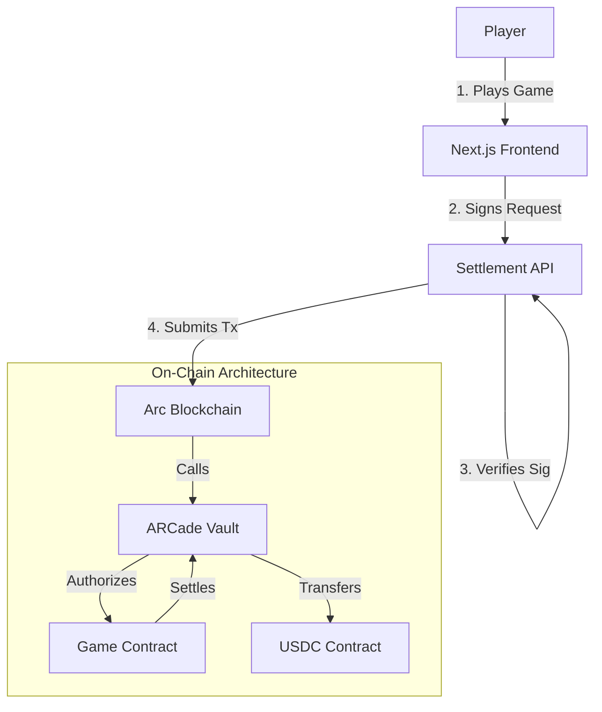

<div align="center">

# ARCADE ON ARC

### High-Performance Onchain Gaming Protocol

[](https://arc.network)
[](https://circle.com)
[](LICENSE)
[](https://nextjs.org)
[](https://soliditylang.org)

<br />

**Arcade on Arc** is a decentralized gaming protocol designed for sub-second settlement and institutional-grade security. Built natively on **Arc**—Circle's high-performance stablecoin blockchain—it eliminates volatility by using **USDC** as the gas and settlement token.

[Documentation](./docs) · [Report Bug](https://github.com/cassxbt/arcade-on-arc/issues) · [Request Feature](https://github.com/cassxbt/arcade-on-arc/issues)

---


</div>

<br />

## Why Arc?

We chose Arc to solve the three fundamental problems of onchain gaming: **Latency**, **Volatility**, and **Cost**.

| Feature | Arcade on Arc | Traditional Chains |
|---------|---------------|-------------------|
| **Finality** | **<350ms** (Instant) | 12-60 seconds |
| **Gas Token** | **USDC** (Stable) | ETH/SOL (Volatile) |
| **Tx Cost** | **~$0.01** | $2.00 - $50.00 |
| **Compliance** | **Built-in** | Fragmented |

## Architecture

The system utilizes a central Vault contract to manage liquidity, authorized game controllers to settle bets, and a Next.js frontend for player interaction.



### Component Stack
*   **Smart Contracts**: Solidity 0.8.20 (Foundry)
*   **Frontend**: Next.js 16, React 19, TailwindCSS
*   **Indexing**: Supabase (Leaderboards)
*   **Auth**: Dynamic (Wallet Connect)
*   **Infrastructure**: Arc Testnet (Reth-based)

## Game Modes

| Game | Contract Address | House Edge | Max Multiplier |
|------|------------------|------------|----------------|
| **Dice** | `0xB91ddfe1567c38B259f417604755Dc58cdf73f0C` | 1.0% | 99x |
| **Crash** | `0x09e1bC3c33aa0A7e0a68cec3c00C44FD4E2dd5Db` | 1.0% | ∞ |
| **Tower** | `0x7d1F094C8B48cBb7E9a017059eeC5a33eD4c243f` | 3.0% | Varies |
| **Wheel** | `0x5907775345715b9F0ac1b00027Cd96B8fEE1e850` | 2.5% | 5x |
| **Laser** | `0xcBdff4f22bb291067EF9E36E2202c4d736739579` | 4.0% | 95x |

> **Note**: Contracts are currently deployed on **Arc Testnet**. All USDC is testnet currency.

## Security & Verification

This protocol utilizes a "Defense in Depth" security strategy:

1.  **Strict Request Signing**: All API settlement requests require HMAC-SHA256 signatures from the frontend.
2.  **Rate Limiting**: API endpoints are rate-limited to 20 requests/minute per IP.
3.  **On-Chain Access Control**: Only whitelisted `Game` contracts can debit the `Vault`.
4.  **Emergency Pause**: All contracts inherit `Pausable` for immediate stoppage in case of incident.
5.  **Test Coverage**: 100% unit test coverage (53/53 tests passed) for all core game logic.

## Quick Start

### Prerequisites
- Node.js 20+
- Foundry (Forge)
- Arc Testnet USDC (from [Circle Faucet](https://faucet.circle.com))

### Installation

```bash
# 1. Clone
git clone https://github.com/cassxbt/arcade-on-arc.git
cd arcade-on-arc

# 2. Install Dependencies
cd arcade && npm install
cd ../contracts && forge install
```

### Configuration
1.  Copy `.env.example` to `.env.local` in `arcade/`
2.  Set `NEXT_PUBLIC_DYNAMIC_ENVIRONMENT_ID` and `SIGNER_PRIVATE_KEY`
3.  Ensure `API_SIGNING_SECRET` matches on client and server

### Running Locally

```bash
# Start Next.js Development Server
cd arcade
npm run dev
# Server running at http://localhost:3000
```

## Roadmap

*   **Phase 1: Foundation (Complete)**
    *   [x] Core Contracts (Vault, Games)
    *   [x] Frontend UI (Next.js)
    *   [x] Wallet Integration (Dynamic)
    *   [x] Security Hardening (Rate limits, Signatures)

*   **Phase 2: Expansion (Current)**
    *   [x] New Games (Wheel, Laser)
    *   [ ] Leaderboard Rewards System
    *   [ ] Referral Program

*   **Phase 3: Mainnet**
    *   [ ] Chainlink VRF Integration
    *   [ ] Security Audit
    *   [ ] Mainnet Launch

---

<div align="center">
    <b>Built with 💚 by cassxbt</b><br/>
    <a href="https://twitter.com/cassxbt">Twitter</a> • <a href="https://github.com/cassxbt">GitHub</a>
</div>
