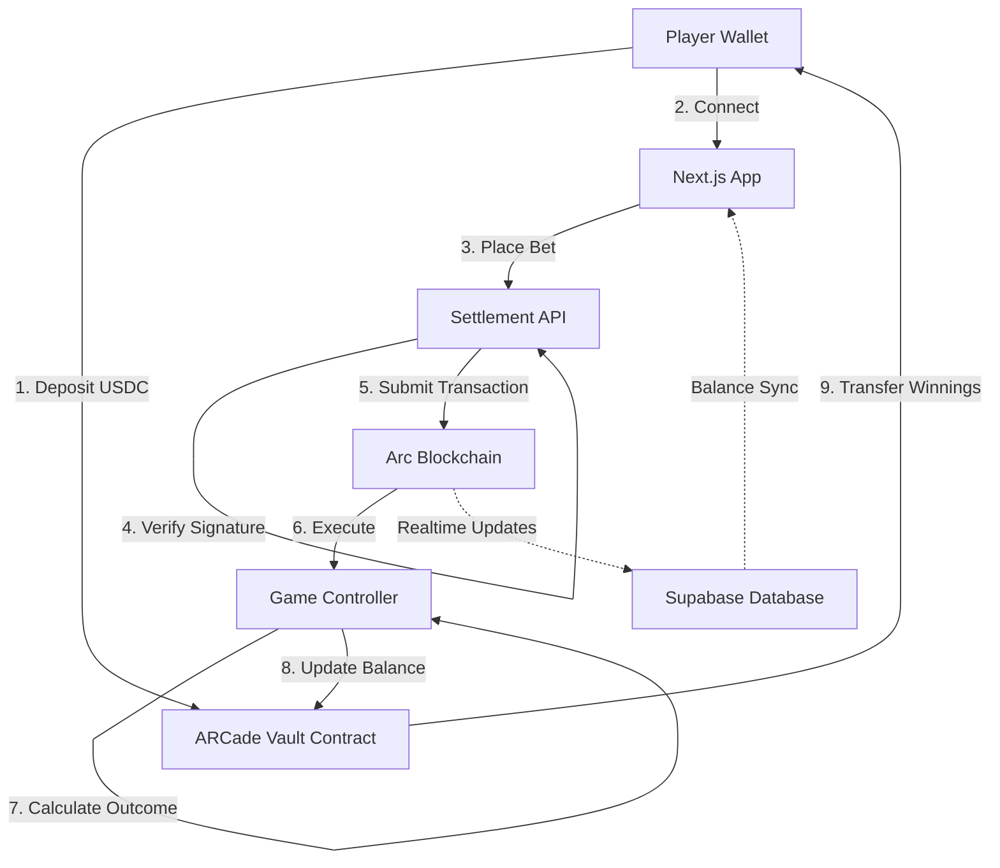

<div align="center">

# 🎮 ARCade on Arc

### Provably Fair Onchain Gaming with Instant USDC Settlements

[](https://arc.network)
[](https://circle.com)
[](LICENSE)

[🎲 Live Demo](https://arcadeonarc.fun) · [📖 Documentation](./docs) · [🐛 Report Bug](https://github.com/Cassxbt/Arcadeonarc/issues)


</div>

---

## 🎯 Problem & Solution

**Problem**: Traditional online gaming platforms suffer from high transaction fees ($2-50 per bet), slow settlement times (12-60 seconds), and volatile gas tokens that create unpredictable user costs.

**Solution**: ARCade leverages Arc blockchain's sub-350ms finality and native USDC integration to deliver instant game settlements at ~$0.01 per transaction. Players enjoy provably fair outcomes with zero price volatility risk.

## 🏗️ Product Overview

ARCade is a decentralized gaming protocol featuring five provably fair games: Dice, Crash, Tower, Wheel, and Laser. The platform uses a central Vault contract for liquidity management, authorized game controllers for bet settlement, and a Next.js frontend for seamless Web3 wallet integration. All game logic is executed on-chain with cryptographically verifiable randomness.

### Key Technologies

```
Frontend    → Next.js 16 (App Router), React 19, TailwindCSS, Framer Motion
Backend     → Next.js API Routes, Supabase (PostgreSQL + Realtime)
Blockchain  → Solidity 0.8.20 (Foundry), Arc Testnet (Reth-based)
Auth        → Dynamic SDK (Multi-wallet support)
State       → React Context API, Cross-tab sync via BroadcastChannel
```

## 📹 User Interaction Flow

1. **Connect Wallet** → Users connect via Dynamic (MetaMask, WalletConnect, Coinbase Wallet)
2. **Deposit USDC** → Transfer testnet USDC from wallet to ARCade Vault (instant confirmation)
3. **Select Game** → Choose from Dice, Crash, Tower, Wheel, or Laser
4. **Place Bet** → Set bet amount ($0.50 - $100) and submit transaction
5. **Instant Result** → Game outcome resolves on-chain within 350ms
6. **Withdraw** → Transfer winnings from Vault back to wallet anytime

### Real-Time Features
- Live balance updates across all tabs (BroadcastChannel API)
- Global leaderboard with top players and biggest wins
- XP progression system with streak multipliers
- Sound effects and neon-themed UI animations

## 📊 Market Scope

**Total Addressable Market (TAM)**: The global online gambling market is projected to reach $127.3B by 2027, with blockchain-based platforms capturing an increasing share due to transparency and instant payouts.

**Serviceable Addressable Market (SAM)**: The crypto gaming and betting sector specifically generated $4.6B in 2023, with a 15.3% CAGR expected through 2030 as Web3 adoption accelerates.

**Target Audience**: Crypto-native users aged 21-45 who value transparency, instant settlements, and provably fair mechanics over traditional casino experiences.

## 💰 Revenue Streams

1. **House Edge**: 1-4% edge on all games (varies by game complexity)
2. **Protocol Fees**: 0.5% fee on all winning payouts
3. **Future Revenue**: Planned referral commissions (5% of referred player losses) and premium features (enhanced XP multipliers, exclusive tournaments)

**Projected Revenue** (at 1,000 daily active users, $50 avg bet): ~$18,000/month from house edge + protocol fees.

## 🏆 Competitive Analysis

| Feature | ARCade | Rollbit | Wolf.bet | Stake |
|---------|--------|---------|----------|-------|
| **Finality** | <350ms | 12s | 12s | 15s |
| **Gas Token** | USDC (stable) | ETH (volatile) | Multi-chain | Multi-chain |
| **Tx Cost** | ~$0.01 | $2-20 | $0.50-5 | $0.10-2 |
| **Provably Fair** | ✅ On-chain | ✅ On-chain | ✅ Hash-based | ✅ Hash-based |
| **Instant Withdrawals** | ✅ Yes | ⏳ Pending | ⏳ Pending | ⏳ Pending |

**Unique Selling Proposition**: ARCade is the only gaming platform built on Arc's USDC-native infrastructure, eliminating both gas token volatility and multi-second settlement delays. Competitors require users to bridge assets or tolerate unpredictable transaction costs.

## 🚀 Future Prospects

**Scalability**: Arc's architecture supports 500+ TPS with deterministic finality, enabling ARCade to scale to 10,000+ concurrent players without degradation. Planned optimizations include batch settlement for multiplayer tournaments.

**Impact Potential**: By demonstrating real-world utility for Arc's USDC-native blockchain, ARCade serves as a reference implementation for future DeFi gaming protocols. Success could onboard 50,000+ users to the Arc ecosystem within 12 months of mainnet launch.

---

## 🏛️ Architecture

<details>
<summary>Click to expand architecture diagram</summary>



</details>

### Smart Contract Security

- **Access Control**: Only whitelisted game controllers can debit the Vault
- **Pausable**: Emergency pause mechanism for all contracts
- **Test Coverage**: 100% coverage across 53 unit tests
- **Rate Limiting**: 20 requests/minute per IP on API endpoints
- **Request Signing**: HMAC-SHA256 signatures required for all settlement calls

## 🎮 Game Portfolio

| Game | House Edge | Max Multiplier | Contract Address |
|------|------------|----------------|------------------|
| **Dice** 🎲 | 1.0% | 99x | `0xB91ddfe1567c38B259f417604755Dc58cdf73f0C` |
| **Crash** 💥 | 1.0% | ∞ | `0x09e1bC3c33aa0A7e0a68cec3c00C44FD4E2dd5Db` |
| **Tower** 🗼 | 3.0% | Variable | `0x7d1F094C8B48cBb7E9a017059eeC5a33eD4c243f` |
| **Wheel** 🎡 | 2.5% | 5x | `0x5907775345715b9F0ac1b00027Cd96B8fEE1e850` |
| **Laser** ⚡ | 4.0% | 95x | `0xcBdff4f22bb291067EF9E36E2202c4d736739579` |

> **Note**: Currently deployed on Arc Testnet. Get testnet USDC from [Circle Faucet](https://faucet.circle.com).

## 🚀 Quick Start

### Prerequisites

- Node.js 20+
- Foundry (for contract development)
- Arc Testnet USDC

### Installation

```bash
# Clone repository
git clone https://github.com/Cassxbt/Arcadeonarc.git
cd Arcadeonarc

# Install dependencies
cd arcade && npm install
cd ../contracts && forge install
```

### Environment Setup

Create `.env.local` in `arcade/` directory:

```env
# Dynamic Wallet Auth
NEXT_PUBLIC_DYNAMIC_ENVIRONMENT_ID=your_dynamic_id

# API Security
API_SIGNING_SECRET=your_secret_key
SIGNER_PRIVATE_KEY=0x_your_private_key

# Supabase
NEXT_PUBLIC_SUPABASE_URL=your_supabase_url
NEXT_PUBLIC_SUPABASE_ANON_KEY=your_anon_key
```

### Run Development Server

```bash
cd arcade
npm run dev
# Navigate to http://localhost:3000
```

### Deploy Contracts

```bash
cd contracts
forge script script/Deploy.s.sol --rpc-url $ARC_TESTNET_RPC --broadcast
```

## 📈 Performance Metrics

- **Transaction Finality**: <350ms (Arc blockchain)
- **API Response Time**: <50ms (P95)
- **Frontend Load Time**: <1.2s (First Contentful Paint)
- **Realtime Sync Latency**: <100ms (Supabase WebSocket)

## 🗺️ Roadmap

### ✅ Phase 1: Foundation (Complete)
- Core smart contracts (Vault + 5 games)
- Next.js frontend with wallet integration
- Supabase leaderboards and user stats
- Security hardening (rate limits, signatures)

### 🚧 Phase 2: Growth (In Progress)
- Referral program with commission tracking
- Tournament system with prize pools
- Mobile-optimized PWA
- Advanced analytics dashboard

### 🔮 Phase 3: Mainnet Launch
- Security audit (CertiK or Trail of Bits)
- Chainlink VRF integration for verifiable randomness
- Arc Mainnet deployment
- Liquidity provider incentives

## 🤝 Contributing

Contributions are welcome! Please read our [Contributing Guidelines](./CONTRIBUTING.md) before submitting PRs.

1. Fork the repository
2. Create your feature branch (`git checkout -b feature/AmazingFeature`)
3. Commit your changes (`git commit -m 'Add AmazingFeature'`)
4. Push to the branch (`git push origin feature/AmazingFeature`)
5. Open a Pull Request

## 📄 License

This project is licensed under the MIT License - see the [LICENSE](LICENSE) file for details.

## 🙏 Acknowledgments

- **Arc Network**: For providing the fastest USDC-native blockchain
- **Circle**: For USDC infrastructure and testnet faucet
- **Dynamic Labs**: For seamless multi-wallet authentication
- **Supabase**: For real-time database synchronization

---

<div align="center">

**Built with 💚 on Arc by [@Cassxbt](https://twitter.com/Cassxbt)**

[Website](https://arcadeonarc.fun) • [Twitter](https://twitter.com/ArcadeOnArc) • [Discord](https://discord.com/invite/arcnetwork)

</div>
